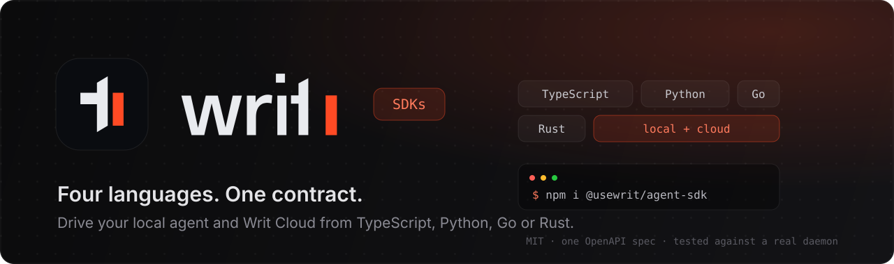

<div align="center">
  

  <br/>

  <p align="center">
    <a href="https://github.com/usewrit/writ-sdks/actions/workflows/ci.yml"></a>
    <a href="https://www.npmjs.com/package/@usewrit/agent-sdk"></a>
    <a href="https://pypi.org/project/writ-agent/"></a>
    <a href="https://crates.io/crates/writ-client"></a>
    <a href="https://pkg.go.dev/github.com/usewrit/writ-sdks/go"></a>
    <a href="./LICENSE"></a>
  </p>

  <h3 align="center">Four languages. One contract.</h3>

  <p align="center">
    <a href="#install"><b>Install</b></a> ·
    <a href="#point-them-wherever-you-run-writ"><b>Targets</b></a> ·
    <a href="#quick-start"><b>Quick start</b></a> ·
    <a href="./DESIGN.md"><b>Contract</b></a> ·
    <a href="./SECURITY.md"><b>Security</b></a> ·
    <a href="./CONTRIBUTING.md"><b>Contributing</b></a>
  </p>
</div>

---

Official SDKs for [Writ](https://github.com/usewrit/writ). They drive the
**`writ-agentd` daemon on your own machine** — run saved browser workflows, read
the data they collect, manage monitors and automations, record new ones — and the
crawl surface (scrape a page to clean markdown, map a site, run a crawl, save a crawl
and call it again) against **your own self-hosted coordinator or Writ Cloud**,
whichever you run.

Same code either way: one env var decides where the work happens. All four SDKs
implement the same specification, so an example translates almost line for line
between them.

## Install

| Language | Package | Install |
|---|---|---|
| **TypeScript** | [`@usewrit/agent-sdk`](https://www.npmjs.com/package/@usewrit/agent-sdk) | `npm i @usewrit/agent-sdk` |
| **Python** | [`writ-agent`](https://pypi.org/project/writ-agent/) | `pip install writ-agent` |
| **Go** | [`github.com/usewrit/writ-sdks/go`](https://pkg.go.dev/github.com/usewrit/writ-sdks/go) | `go get github.com/usewrit/writ-sdks/go` |
| **Rust** | [`writ-client`](https://crates.io/crates/writ-client) | `cargo add writ-client` |

Requirements: Node ≥18 · Python ≥3.10 · Go ≥1.23 · Rust stable.

Other languages: [`codegen/`](codegen/) generates raw REST bindings for Java, C#,
Ruby and PHP from the OpenAPI spec. Those are unsupported and lack discovery and
`run_and_wait` — see [`DESIGN.md`](DESIGN.md) §4/§8 to port those helpers.

## Point them wherever you run Writ

The same client covers **three targets**. Pick per use case — or use more than
one from the same process.

| Target | What it is | How you point at it |
|---|---|---|
| **Desktop / local agent** | `writ-agentd` on your own machine, over loopback | automatic discovery — nothing to configure |
| **Self-hosted coordinator** | *your* Writ server, your hardware, your data | `WRIT_CLOUD_URL=https://writ.example.com` + an API key from that instance |
| **Writ Cloud** | the hosted service | default — just set `WRIT_API_KEY` |

### 1. Desktop / local agent

The default. The client finds the running daemon and its token by itself
(`127.0.0.1:8131`, HTTPS twin on `:8132`). Nothing leaves the machine. This is
where workflows, runs with live SSE events, data, monitors, selectors and
extractors, automations, personas, secrets, files and API keys live.

```python
writ = WritAgent()          # discovers the local daemon
writ.workflows.list()
```

### 2. Your self-hosted coordinator

The `.cloud` namespace is **not hosted-only** — it speaks the coordinator's own
API, which your self-host instance already serves. Point it at your server and
the whole surface runs on your infrastructure: `scrape`, `map`, `crawl` /
`crawl_status`, `monitors` (including `run` and `watch`), `automations` and
`personas`. Same verbs, same shapes, same guarantees as the hosted tier — the
only difference is which URL you set:

```python
writ = WritAgent(cloud_url="https://writ.example.com", api_key="wt_...")
writ.cloud.map("https://example.com")      # runs on YOUR coordinator
```

```bash
export WRIT_CLOUD_URL=https://writ.example.com
export WRIT_API_KEY=wt_...                 # Settings → Developers → API keys
```

Create the key in your own instance under **Settings → Developers → API keys**.
Because a key is present, calls resolve to the *metered* tier — which on your own
server means your own metering, and no keyless client id is ever created. (The
keyless tier is a hosted-only concept; a self-host operator always has a key.)

Your coordinator honours `Idempotency-Key` and serves the same keyset change
cursor as the hosted tier, so retried writes cannot duplicate and
`monitors.watch()` behaves identically on your own hardware.

### 3. Writ Cloud

Identical code, default base URL — set `WRIT_API_KEY` and go. Without a key,
cloud calls fall back to a free daily-capped *keyless* tier.

> **Writ Cloud has not launched yet.** `https://api.usewrit.app` does not
> resolve, so target 3 currently fails with a connection error. **Targets 1 and 2
> work today** — the local agent and a self-hosted coordinator are both fully
> usable right now.

> **Keyless calls send a persistent id.** Enforcing a free daily cap requires
> recognising the caller across runs, so the first *keyless* cloud call mints a
> random id at `~/.writ/client_id` and sends it thereafter. Local usage and
> keyed usage — including self-host — never create it. Details and how to reset
> it: [`SECURITY.md`](./SECURITY.md).

## Quick start

Every snippet below does the same three things: talk to the **local agent**
(discovered automatically), then run a crawl-surface call against **your own
coordinator**, then the same call against **Writ Cloud**. Only the constructor
changes — `cloudUrl`/`cloud_url`/`WithCloudURL` is the whole difference.

**TypeScript**

```ts
import { WritAgent } from "@usewrit/agent-sdk";

// 1. Local agent — discovers the running daemon and its token.
const writ = await WritAgent.discover();
const workflows = await writ.workflows.list();
const run = await writ.workflows.runAndWait(workflows.data[0].id, {
  inputs: { query: "espresso" },
});
console.log(run.status);

// 2. Your self-hosted coordinator — the crawl surface, on your hardware.
const selfhost = new WritAgent({
  cloudUrl: "https://writ.example.com",
  apiKey: process.env.WRIT_API_KEY,
});
console.log(await selfhost.cloud.map("https://example.com"));

// 3. Writ Cloud — same call, default base URL.
const cloud = new WritAgent({ apiKey: process.env.WRIT_API_KEY });
console.log((await cloud.cloud.scrape("https://example.com")).markdown);
```

**Python**

```python
from writ_agent import WritAgent

# 1. Local agent
writ = WritAgent()                       # discovers the running agent + token
workflows = writ.workflows.list()
run = writ.workflows.run_and_wait(workflows.data[0]["id"], inputs={"query": "espresso"})
print(run.status)

# 2. Your self-hosted coordinator
selfhost = WritAgent(cloud_url="https://writ.example.com", api_key="wt_...")
print(selfhost.cloud.map("https://example.com"))

# 3. Writ Cloud
cloud = WritAgent(api_key="wt_...")
print(cloud.cloud.scrape("https://example.com")["markdown"])
```

`AsyncWritAgent` is the same API with `await`.

**Go**

```go
// 1. Local agent
client := writ.New()
workflows, err := client.Workflows.List(ctx, nil)
run, err := client.Workflows.RunAndWait(ctx, workflows.Data[0].ID, nil)
fmt.Println(run.Status)

// 2. Your self-hosted coordinator
selfhost := writ.New(
    writ.WithCloudURL("https://writ.example.com"),
    writ.WithAPIKey(os.Getenv("WRIT_API_KEY")),
)
m, err := selfhost.Cloud.Map(ctx, "https://example.com", nil)
fmt.Println(len(m.URLs), "urls")

// 3. Writ Cloud
cloud := writ.New(writ.WithAPIKey(os.Getenv("WRIT_API_KEY")))
page, err := cloud.Cloud.Scrape(ctx, "https://example.com")
fmt.Println(page.Markdown)
```

**Rust**

```rust
// 1. Local agent
let client = WritClient::discover().await?;
let workflows = client.workflows().list(None).await?;
let run = client.workflows().run_and_wait(workflows.data[0].id, None).await?;
println!("{}", run.status);

// 2. Your self-hosted coordinator
let selfhost = CloudClient::builder()
    .cloud_url("https://writ.example.com")
    .api_key(std::env::var("WRIT_API_KEY")?)
    .build()?;
println!("{:?}", selfhost.map("https://example.com", &MapOptions::default()).await?);

// 3. Writ Cloud
let cloud = CloudClient::from_env()?;
println!("{}", cloud.scrape("https://example.com").await?.markdown);
```

Or skip the constructor entirely and set it in the environment — this is all it
takes to move every crawl call from Writ Cloud onto your own server:

```bash
export WRIT_CLOUD_URL=https://writ.example.com
export WRIT_API_KEY=wt_...
```

> Method names follow each language's conventions — `runAndWait` /
> `run_and_wait` / `RunAndWait`. Consult the SDK's own README for exact
> signatures.

## What's shared

Because these implement one contract rather than four independent clients:

- **Discovery**, identical everywhere: explicit config → `WRIT_API_URL` /
  `WRIT_TOKEN` → `$WRIT_HOME/runtime.json` → `~/.writ/active_profile` → that
  profile's descriptor → `~/.writ/runtime.json` → a bounded profile scan. Each
  candidate is liveness-probed with `GET /v1/agent` before it is trusted.
- **Uniform pagination.** The daemon returns three different list envelopes (a
  bare array, `{data,count}`, `{data,count,total}`). All three normalize to one
  `Page {data, count, total?}`, so you never branch on which endpoint you called.
- **Uniform errors**, mapped from the daemon's several error shapes — including
  its plain-text framework rejections — plus the cloud's quota and billing
  conditions.
- **Live run events** over SSE (`started` / `step` / `progress` / `finished` /
  `error`), with a polling fallback if the stream drops. A stream that drops
  before a terminal event reconnects on its own and suppresses the frames you
  already received, so you see one continuous, gap-free, duplicate-free stream
  across a proxy timeout or a restart.
- **`monitors.watch()`** — detected changes as a continuous stream, in detection
  order, with no gaps and no repeats.

  Polling that feed by hand is harder than it looks: the newest-first view
  silently drops changes whenever more than `limit` of them land between two
  polls, and a change row is *updated* (not re-inserted) when the same
  difference recurs, so an id you already processed can resurface. `watch()`
  drives the server's keyset cursor instead, so "everything after this point" is
  exact — and a resurfaced id arrives as what it actually is, a fresh detection.
  Persist the last change's `last_detected_at` + `id` and hand them back as
  `since` / `since_id` to resume across restarts.
- **Retries that cannot duplicate work.** Transient failures (429, 408/425,
  502/503/504, dropped sockets) retry with exponential backoff and full jitter,
  honouring `Retry-After` — except when the server asks for longer than the SDK
  is willing to sleep, where you get the real response instead, which carries the
  reset time.

  `GET`/`HEAD`/`OPTIONS` always retry. `POST`/`PUT`/`PATCH` retry **only** where
  the server honours `Idempotency-Key` (Writ Cloud and a self-hosted
  coordinator), and every attempt of one logical call reuses the same key, so the
  server replays its first answer instead of executing twice. Against the local
  agent — which has no such lane — an unsafe method is never retried, because a
  second `POST` there is a second monitor.
- **Webhook verification.** `verify_webhook` / `verifyWebhook` / `VerifyWebhook`
  authenticates a delivery in constant time and enforces the replay window.
  Verify `X-Writ-Signature-V1`, which covers `"{timestamp}." + body`; the
  body-only `X-Writ-Signature` is still sent for handlers written before V1 and
  is refused by default, because nothing ties it to a point in time. There is a
  signing helper for the inbound direction too.
- **Auto-pagination** over `limit`/`offset` list endpoints, so "list everything"
  is one loop instead of an offset walk you have to remember to write.
- **`run_and_wait`** that times out *without cancelling the run* — the run
  continues server-side; the timeout bounds your wait, not its lifetime.
- **`max_age` freshness**, one contract on both the workflow and the crawl side:
  "an answer collected within this many seconds is acceptable, otherwise go get it
  again". Every answer carries `_cache.hit` / `_cache.age_seconds` in the BODY —
  not only in headers, since an SDK caller receives a decoded payload and would
  never see a header. Omit it and nothing changes: work always runs.
- **Saved crawls.** A crawl row is one RUN whose id dies with it, so
  `crawl.save(...)` stores the settings under a stable slug and `crawl.run_saved(...)`
  re-runs exactly those — or hands back the pages it already collected when
  `max_age` allows. `crawl.saved_data(...)` reads what is there at any age and never
  crawls.
- **File assets on both sides of a run.** A run can consume files (upload steps)
  and produce them (`wait_for_download`), and each direction has one helper:

  `file_slots(workflow)` / `fileSlots` / `FileSlots` reports what you may bind —
  the valid keys for the run's `files` map. Every upload step is an input. One
  that names a slot must be bound by you; one that just pins a file is keyed
  `step:<step id>` and already runs, so binding it *overrides* that file for a
  single run instead of editing the workflow. Each entry carries the pinned file
  as its default, so you can tell the two apart without guessing.

  `output_files(run)` / `outputFiles` / `OutputFiles` returns what the run
  captured — `{file_id, filename, size, content_type, output_key?}` — and the
  bytes come back through the ordinary files API. Both are derived from data you
  already hold, so neither costs a round trip and both work against any daemon
  version.

  ```python
  wf = client.workflows.get(7)
  [s["slot"] for s in file_slots(wf)]          # ['resume', 'step:6f2a…']
  out = client.workflows.run_and_wait(7, files={"resume": "file_abc"})
  for f in output_files(out):
      data = client.files.content(f["file_id"])
  ```

The binding specification is [`DESIGN.md`](DESIGN.md); the wire is documented in
[`openapi/writ-agent.yaml`](openapi/writ-agent.yaml) (OpenAPI 3.1, 73 paths, 102
operations). It documents wire truth **including the inconsistencies** — that is
why the SDKs can paper over them. **When a document and the daemon disagree, the
daemon wins.**

## Repository layout

```
typescript/   @usewrit/agent-sdk         zero runtime dependencies
python/       writ-agent                 httpx
go/           .../writ-sdks/go           standard library only
rust/         writ-client                reqwest + serde
openapi/      writ-agent.yaml            OpenAPI 3.1 description of the wire
codegen/      generate.sh                Java/C#/Ruby/PHP via openapi-generator
DESIGN.md                                the binding cross-language contract
```

## Not covered in 1.1.x

OAuth authorization-server endpoints (the SDKs consume tokens, they don't mint
them), the `/mcp` JSON-RPC surface — use
[`writ-mcp`](https://github.com/usewrit/writ-mcp) for that — OpenAI-compatible
routes, marketplace routes, backup/update/network/TLS administration, and the AI
surfaces. The record and AI-preview WebSockets are covered only as ticket minting.

## Development

Each SDK is independent — you can work on one without installing the others.

```bash
cd typescript && npm ci && npm test
cd python     && pip install -e ".[dev]" && python -m pytest -q
cd go         && go test -race ./...
cd rust       && cargo test
```

Every SDK also carries a **live smoke test** that discovers a real `writ-agentd`
and makes read-only calls, skipped unless `WRIT_SMOKE=1`. See
[`CONTRIBUTING.md`](./CONTRIBUTING.md) — note the two rules there: a behaviour
change belongs in **all four** SDKs in one pull request, and TypeScript and Go
stay at **zero runtime dependencies**.

## The rest of Writ

| | |
|---|---|
| [**usewrit/writ**](https://github.com/usewrit/writ) | The self-host coordinator — web UI, API, your data. |
| [**usewrit/writ-agent**](https://github.com/usewrit/writ-agent) | The Rust agent these SDKs talk to. |
| [**usewrit/writ-mcp**](https://github.com/usewrit/writ-mcp) | Connect Claude Code, Claude Desktop or Cursor to Writ over MCP. |

## License

**MIT** — see [`LICENSE`](./LICENSE).
